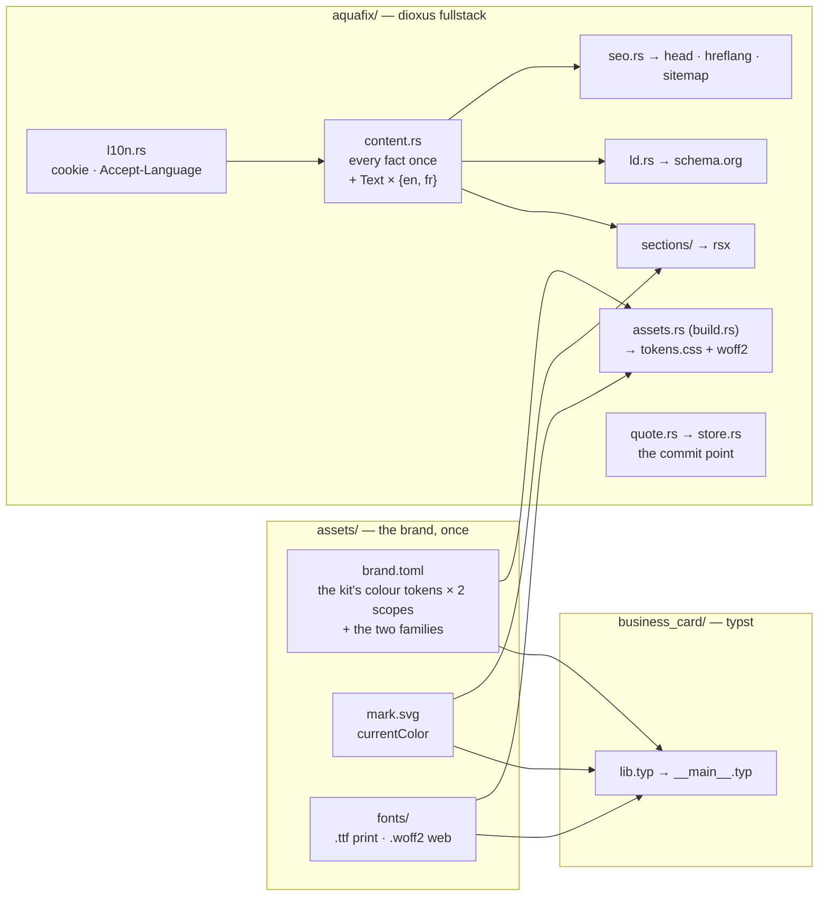

# Architecture

Aquafix sells one thing — a plumbing job at a price agreed before work starts —
and the repo exists to make that offer visible in the three places a customer
meets it: a printed card, a landing page, and whatever a search engine shows.
All three render the same facts.

## Directional invariants

These are the trade-offs that decide the ones this file does not list.

**The visitor is standing in water.** Every performance and interaction call
resolves in favour of the emergency case: content server-rendered so it is on
screen before any wasm arrives, a form that submits without hydration, native
HTML wherever it does the job. A feature that is faster to build but only works
after the bundle loads is not cheaper — it is a lost customer.

**One fact, one place.** A price row renders a table cell *and* emits its
schema.org `Offer` from a single `u32`. A description is one field read by the
`<head>`, the OG card and the sitemap. This is the property that makes the
placeholder phone number and licence safe to hold in the tree: replacing them
cannot half-land.

A second language does not weaken this. The language-free half of a record — the
price, the slug, the licence, the crew member's name — is written once in `EN`,
and `the_language_free_half_of_every_record_is_identical` is what holds `FR` to
it. A French price that drifts from its English twin would put one number on the
page and another in the `Offer`, and that test is the only thing that would
notice.

**The copy is argued, not written.** Every section traces to graded conversion
evidence in `docs/refs/sites/README.md`. Improving a headline without going back
to that argument silently detaches the page from its reasoning. `FR` is a
translation of that graded copy, not a second grading of it.

**Copper is the action.** `primary` marks the call to action, the eyebrow and
the price. It used to be two values a shade apart — one that could only be a
fill and one that could only be text. Authoring one copper legible as both is
the resolution the split never reached, and it is why `on-primary` exists: a
role that gets filled says what reads on it, because neither polarity derives
that.

## Codemap

| where | owns |
|---|---|
| `assets/` | `brand.toml`, `mark.svg`, `fonts/`. The only place a brand value is written. |
| `business_card/` | The typst card. Reads `assets/` with `--root ..`. Its Figma-parity test is the guard that the shared move did not change the print output. |
| `aquafix_assets/build.rs` | Run from `aquafix`'s `build.rs`. Derives `aquafix/assets/` (gitignored) from `assets/`: stages the woff2s, emits `tokens.css` and writes out the kit's class inventory for Tailwind to scan. Owns the list of tokens the kit needs, and fails the build if either scope has a hole. |
| `aquafix/src/` | The site. Local conventions in `aquafix/src/README.md`. |
| `aquafix/src/l10n.rs` | Server-only. Decides which language a request gets before the router sees it: `?lang=` mints the cookie, `/en/*` 301s to the unprefixed URL, an unprefixed entry with no cookie negotiates `Accept-Language`. English is unprefixed and canonical; French lives under `/fr`. |
| `deploy/config.nix` | Prod `AppConfig`, evaluated to JSON at build time and passed as `--config`. |
| `flake.nix` | `dev` / `test` / `accept-test` / `figma-parity` / `size`, the release build and the container. `tmp/site_dev_plans/nix.md` records what each non-obvious line prevents. |

## Boundaries

**`assets/` → everything.** Values only, no layout. Typst reads the TOML
natively; the site reads it through a build script. Neither knows about the
other, and adding a third consumer costs one reader.

**`content.rs` → `sections/`.** A section receives its slice and nothing else.
It may not contain a literal string of copy, and it may not write a spacing, a
corner or a type-scale class — the band rhythm, the gutter, the headline scale,
the CTA's shape and the panel a section is drawn as are tokens (`--band-py`,
`--page-px`, `--display-scale`, `--control-*`, `--panel-*`), written once in
`aquafix/input.css`. The constraint is what keeps a global retuning to one file.

**`store.rs` is the commit point.** A lead is durable before the customer is
told their price is coming. Notification failure logs at `error!` and changes
nothing; a store failure is a 500, never a redirect to `/thanks`.

## Cross-cutting

**`ev_lib::uikit` is the kit**, on its `modern` token feature. Its class tables
name only roles — `bg-card`, `text-ink`, `border-border`, `bg-primary` — and
`assets/brand.toml` fills those names with this brand's values, in two scopes.
Nothing here overrides a kit class to get a colour, which is the property that
makes taking the dependency cheaper than not.

Two things this design needed and the kit gained: a band whose *polarity is a
scope class* rather than a prop threaded through every child, and control
geometry behind tokens so a call to action is `Button { size: Xl }` and not a
bespoke anchor. The site's whole layout vocabulary — `Section`, `SectionHead`,
`Display`, `Prose`, `Stat`, `Check` — is the kit's.

Tailwind cannot scan a crate it did not vendor, so `ev_lib_classes` carries its
class literals as a string and the build script writes them out to `@source`.

Where a native element does the job it still wins: `
` for the FAQ and
the mobile drawer, a native `<select>` in the quote form, a `<label>` wrapping
its input. The kit's `Select` is a `div` combobox and its `Field` mints ids from
a `FormControl` — both are hydration-shaped, and this form has to submit before
any wasm arrives. The invariant outranks the reuse.

**`ev_lib::analytics` is not a dependency.** Right on shape — pure-Rust PostHog,
no JS SDK, no autocapture — it was adopted, then measured out. It POSTs through
`reqwest`, which cost **236 KB of a 1.03 MB release wasm**: 1,059,047 B with it,
823,287 B with analytics removed entirely. The same five events over
`navigator.sendBeacon` cost ~10 KB. On the one metric this site is built around
that is not a defensible price, and the size budget is what surfaced it. What
would change it is a transport that is not a full HTTP client.

**Analytics records; it never decides what renders.** No A/B system: the copy is
argued from evidence, and one landing page's traffic cannot power a test.

**Testing is layered by cost** (`tmp/site_dev_plans/testing.md`). insta SSR
snapshots catch structure and class drift; Playwright catches layout at the two
designed breakpoints; the Figma blur-diff is advisory and catches gross drift
only. The wasm budget is the one hard gate, because it is the one number the
emergency visitor pays for directly.
