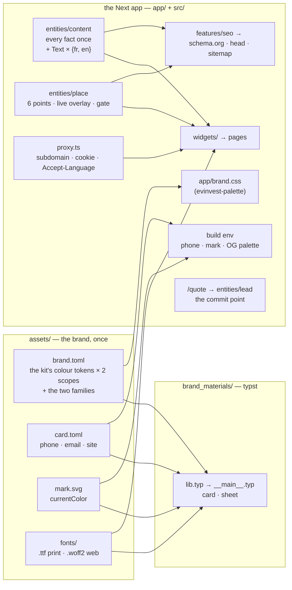

# Architecture

Aquafix sells one thing — a plumbing job at a price agreed before work starts —
and the repo exists to make that offer visible in the three places a customer
meets it: a printed card, a landing page per point, and whatever a search
engine shows. All three render the same facts.



## Directional invariants

These are the trade-offs that decide the ones this file does not list.

**The visitor is standing in water.** Every performance and interaction call
resolves in favour of the emergency case: pages server-rendered so they are on
screen before any script arrives, a form that submits without hydration,
native HTML wherever it does the job. A feature that is faster to build but
only works after the bundle loads is not cheaper — it is a lost customer. In
Next terms: `"use client"` only on leaves that cannot be anything else (the
analytics boundary, the click-to-load map), and the quote form is a plain
`<form method="post" action="/quote">` answered with a 303.

**One fact, one place.** A price row renders a table cell *and* emits its
schema.org `Offer` from a single integer in `PRICE_LIST`. A description is one
field read by the `<head>`, the OG card and the sitemap. This is the property
that makes the placeholder licence safe to hold in the tree: replacing it
cannot half-land. The phone goes one step further — it is `assets/card.toml`'s,
inlined at build, so the card, the vCard and every CTA read the same field.

A second language does not weaken this. The language-free half of a record —
the price, the job slug, the service's price row — is written once in
`entities/content/model/catalogue.ts`, and each language gives it words through
a `Record` over the ids. A French price cannot drift from its English twin:
there is one number. `FR` and `EN` are two objects of one `Text` type checked
with `satisfies`, so a field added to one and not the other does not compile.
Prose that quotes a fact takes it as an argument (`(f: Facts) => string`)
instead of spelling it out.

**The copy is argued, not written.** Every section traces to graded conversion
evidence in `docs/refs/sites/README.md`. Improving a headline without going
back to that argument silently detaches the page from its reasoning. `EN` is
the graded copy moved to France (euros with TVA, kilometres, SIRET and
décennale in place of US licences); `FR` translates it and does not re-grade it.

**Copper is the action.** `primary` fills the call to action; `primary-ink` is
the same hue as text, a step darker on light, because the fill (3.70:1 on
white) is not legible as small type. `on-primary` says what reads on the fill.

**A point earns its index.** Six points under one brand, each on its own
subdomain, is close to what Google's spam policy calls doorway pages. So a
point is `noindex` and out of the sitemap until it says something its
neighbours cannot: a storefront photo, a landmark, its service area and real
hours (`publicationGaps`). The page still answers — its phone is real.

**Structured data says only what is true.** No `aggregateRating` from anything
the repo holds; a rating appears only when the live source mirrored Google's
within the API's 30-day window. The ratings in the copy are placeholders the
owner chose to keep on the page, not in the schema.

## Codemap

| where | owns |
|---|---|
| `assets/` | `brand.toml`, `card.toml`, `mark.svg`, `fonts/`, `photos/`. The only place a brand value or a contact fact is written. |
| `brand_materials/` | Everything printed: the card and the A4 door sheet. Reads `assets/` with `--root ..`. |
| `app/` | Routes only. `[locale]/` is the root layout (so `<html lang>` is right on the first byte); `[locale]/[location]/` the point's pages; `quote`, `og`, `health`, `sitemap`, `robots` the non-page routes. `brand.css` is generated by `npm run palette` and held to its source by a test. |
| `proxy.ts` → `src/features/request-routing` | Which point and which language a request gets, before any route renders. |
| `src/shared` | Config (`site` — the composition root every brand fact is read from —, the `i18n` registry, the server env), money formatting, the lock-up. |
| `src/shared/landing` | The brand-free machinery a future shared landing package takes whole: `core/` is pure (no React, Next or `node:*`; eslint holds the line), `server/` the Node half (the SMTP client). |
| `src/entities/content` | Every string, once per language, and the language-free catalogue. |
| `src/entities/place` | The six points bound to the site: baked data from `shared/config/places.ts`, the live overlay, the publication gate, URLs. The model (`Place` with a storefront or service-area `presence`, `PlaceView`, the gate as a policy) is in `shared/landing/core/place`. |
| `src/entities/lead` | The lead, its SQLite store and its notifier. |
| `src/features` | The quote form and its acceptance, analytics, SEO, the map facade. |
| `src/widgets` | One band per file, ≤120 lines, over a `Copy` and a `PlaceView`. |
| `src/views` | The compositions: a point's home, its sub-pages, its status screens; the brand page. |

## Routing

```text
royat.aquafix.top/                → 302 /fr or /en (cookie, then Accept-Language), Vary
royat.aquafix.top/fr/prices       → renders app/[locale]/[location]/prices for royat
aquafix.top/fr                    → the brand page, listing the points
aquafix.top/fr/royat/prices       → the same point page, through the apex (fallback)
…?lang=en                         → cookie for a year, 303 to the clean URL
```

Both languages carry a prefix and French is the default: there are no legacy
URLs to keep, and a header-less crawler lands on French and reaches English
through `hreflang`. The negotiation is a **302**, never a 301: the choice is per
visitor. Only page paths are negotiated — `/quote`, the sitemap and assets pass
straight through. The canonical host of a point is always its subdomain, so the
apex fallback never competes with it. Locally, `<slug>.localhost:3000` gets the
subdomain behaviour and `localhost:3000/fr/<slug>` the fallback.

## Boundaries

**`assets/` → everything.** Values only, no layout. Typst reads the TOML
natively; the site reads it at build (`src/shared/config/build-env.ts`, inlined
through `next.config.ts`) and through the kit's `evinvest-palette`. Neither
knows about the other.

**Content → widgets.** A widget receives a `Copy` (language, `Text`, facts) and
a `PlaceView` and nothing else. It may not contain a literal string of copy, and it
may not write its own band rhythm or gutter: `--band-py`, `--page-px`,
`--measure` and `--control-*` are tokens on the brand scope in
`app/globals.css`. The constraint keeps a global retuning to one file.

**Polarity is a scope, not a prop.** `data-brand="aquafix"` and `light` sit on
`<html>`; a `<Section polarity="dark">` puts `dark` on the band and custom
properties inherit, so `text-ink` and `border-border` are right on either side.
A light island inside a dark band (the quote card) says `light` on itself.

**`insert` is the commit point.** A lead is durable before the customer is told
their price is coming. Notification and the analytics event run after the
response (`after()`); their failure logs and changes nothing. A store failure is
a 500 with the phone on it, never a 303 to the thank-you page. The table is the
Rust server's, brought forward in place with `location_id`.

**Live data is an overlay, not a dependency.** `getPlace` merges
`LOCATIONS_API_URL`'s answer over the baked point, with the TTL on the fetch
itself. A 404 is `notFound()`; a 5xx throws (a 500, not a soft 404); an
unreachable source serves the baked point. The sitemap is stricter: with a
source configured, any failure throws, because a truncated sitemap tells a
crawler the points are gone.

**Secrets are not in the image.** `SMTP_URL`, `SMS_TOKEN` and `POSTHOG_KEY`
come from the container environment at runtime. In production
`LEADS_DB_PATH` has no default: without it every request, `/health` included, is a 500
(`instrumentation.ts`) — the Rust server once booted on dev defaults and wrote
leads outside the mounted volume.

## Cross-cutting

**`@evinvest/uikit` is the kit.** Its class tables name only roles —
`bg-card`, `text-ink`, `border-border`, `bg-primary` — and `assets/brand.toml`
fills those names with this brand's values in two scopes through the kit's own
generator, which fails on a hole in either. Nothing here overrides a kit class
to get a colour, and no component writes a hex value.

Where a native element does the job it still wins: `<details>` for the FAQ and
the mobile drawer, a native `<select>` in the quote form, a `<label>` wrapping
its input, `popover` for the work cards. The kit's `Select` and `Field` are
hydration-shaped, and this form has to submit before any script arrives. The
invariant outranks the reuse.

**Analytics records; it never decides what renders.** Cookieless by
construction: `@evinvest/analytics`' beacon sink holds its id in memory,
writes nothing, and needs no consent banner. `sendBeacon`, because the events
that matter — a tap on `tel:` or `wa.me` — hand the visitor to another app.
Every property name is on an allow-list (`brand_id`, `location_id`, `source`,
`device`, `channel`, `form_id`); a customer's phone reaching PostHog could only
be undone by deleting the project's history. `contact_intent_click` is an
intent, not a lead, and is named apart from `lead_form_submit`. No A/B system:
one landing page's traffic cannot power a test.

The history of the Rust version, and the measurement that threw
`ev_lib::analytics`' `reqwest` transport out of the wasm (236 KB of 1.03 MB),
is in git before the port.

**Testing is layered by cost.** vitest holds the invariants that are cheap and
exact: the copy has no hole in either language, every `Offer` is its price
row's integer, no rating leaks into the schema, the negotiation's 302 / cookie
/ whitelist, the publication gate, the lead store's commit point, the
antispam barriers, the palette's generated file. Playwright holds what only a
browser can: one screenshot per section at the two designed breakpoints (1440
and 390), each reached by its own URL fragment rather than a scroll, since a
scroll is a moving target; the quote form posting with JavaScript disabled,
proven by the row in SQLite, because a bot gets the same 303; and
`contact_intent_click` leaving as a beacon when the visitor taps `tel:`. The
baselines are Linux's, taken by CI.

**One hard gate: the weight of the point page.** The gzip of the chunks Next
lists as a point page's first load, against `tests/bundle_budget.txt`. The
visitor is on mobile data in an emergency; the form works without any of it,
so the number is what becoming interactive costs, not whether the page works.
Raising it is a commit that says why. Every other check is a test or advisory.

**The image is the build.** `nix build` runs `next build` in a sandbox with
every npm package pinned by the lockfile's integrity hash, and ships
`.next/standalone` — the server and only the files it was traced to need —
on a slim Node. `deploy/config.nix` is the prod environment, passed
explicitly for the same reason the Rust server's `--config` was.
