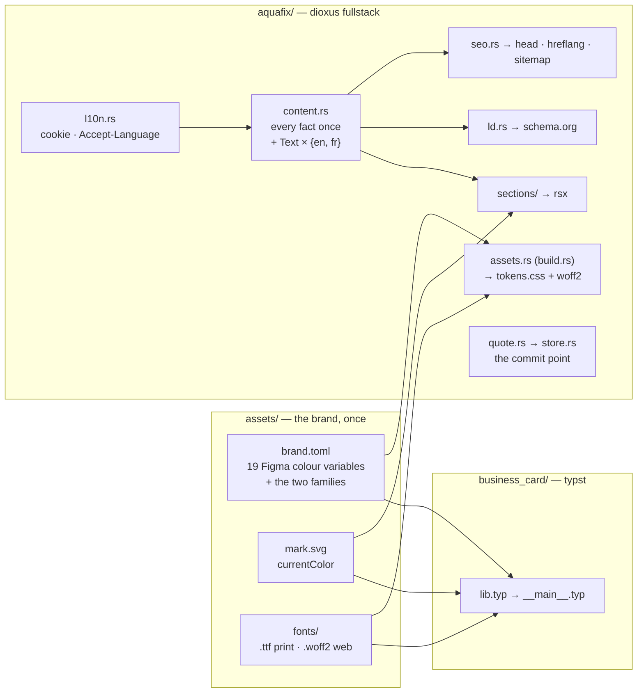

# Architecture

Aquafix sells one thing — a plumbing job at a price agreed before work starts —
and the repo exists to make that offer visible in the three places a customer
meets it: a printed card, a landing page, and whatever a search engine shows.
All three render the same facts.

## Directional invariants

These are the trade-offs that decide the ones this file does not list.

**The visitor is standing in water.** Every performance and interaction call
resolves in favour of the emergency case: content server-rendered so it is on
screen before any wasm arrives, a form that submits without hydration, native
HTML wherever it does the job. A feature that is faster to build but only works
after the bundle loads is not cheaper — it is a lost customer.

**One fact, one place.** A price row renders a table cell *and* emits its
schema.org `Offer` from a single `u32`. A description is one field read by the
`<head>`, the OG card and the sitemap. This is the property that makes the
placeholder phone number and licence safe to hold in the tree: replacing them
cannot half-land.

A second language does not weaken this. The language-free half of a record — the
price, the slug, the licence, the crew member's name — is written once in `EN`,
and `the_language_free_half_of_every_record_is_identical` is what holds `FR` to
it. A French price that drifts from its English twin would put one number on the
page and another in the `Offer`, and that test is the only thing that would
notice.

**The copy is argued, not written.** Every section traces to graded conversion
evidence in `docs/refs/sites/README.md`. Improving a headline without going back
to that argument silently detaches the page from its reasoning. `FR` is a
translation of that graded copy, not a second grading of it.

**Copper is the action.** `action/bg` marks calls to action and nothing else, so
the eye can always find the next step. `brand/accent` is a deliberately
different value for eyebrows and prices.

## Codemap

| where | owns |
|---|---|
| `assets/` | `brand.toml`, `mark.svg`, `fonts/`. The only place a brand value is written. |
| `business_card/` | The typst card. Reads `assets/` with `--root ..`. Its Figma-parity test is the guard that the shared move did not change the print output. |
| `aquafix/assets.rs` | Run from `build.rs`. Derives `aquafix/assets/` (gitignored) from `assets/`: stages the woff2s and emits `tokens.css`. Owns the Figma-name → Tailwind-name map and fails the build on an unmapped colour. |
| `aquafix/src/` | The site. Local conventions in `aquafix/src/README.md`. |
| `aquafix/src/l10n.rs` | Server-only. Decides which language a request gets before the router sees it: `?lang=` mints the cookie, `/en/*` 301s to the unprefixed URL, an unprefixed entry with no cookie negotiates `Accept-Language`. English is unprefixed and canonical; French lives under `/fr`. |
| `deploy/config.nix` | Prod `AppConfig`, evaluated to JSON at build time and passed as `--config`. |
| `flake.nix` | `dev` / `test` / `accept-test` / `figma-parity` / `size`, the release build and the container. `tmp/site_dev_plans/nix.md` records what each non-obvious line prevents. |

## Boundaries

**`assets/` → everything.** Values only, no layout. Typst reads the TOML
natively; the site reads it through a build script. Neither knows about the
other, and adding a third consumer costs one reader.

**`content.rs` → `sections/`.** A section receives its slice and nothing else.
It may not contain a literal string of copy, and it may not write a spacing or
type-scale class — those live only in `blocks.rs`. The constraint is what keeps
a global retuning to one file, and it is where an `Importance` metric would
attach if a second site ever justified inventing one.

**`store.rs` is the commit point.** A lead is durable before the customer is
told their price is coming. Notification failure logs at `error!` and changes
nothing; a store failure is a 500, never a redirect to `/thanks`.

## Cross-cutting

**`ev_lib` is not a dependency**, and the two reasons are different.

Its `uikit` is a real 63-component kit, but shadcn-shaped around the EV palette:
`TABLE` is `"w-full caption-bottom text-sm"`, `CONTAINER_BASE` is a `max-width`
wrapper, `Fonts` bundles Playfair. This design is full-bleed, token-bespoke and
set in Archivo, so every component would have been overridden class by class —
more code than the markup it replaces.

`analytics` was the opposite case on shape — pure-Rust PostHog, no JS SDK, no
autocapture — and was adopted, then measured out. It POSTs through `reqwest`,
which cost **236 KB of a 1.03 MB release wasm**: 1,059,047 B with it, 823,287 B
with analytics removed entirely. The same five events over
`navigator.sendBeacon` cost ~10 KB. On the one metric this site is built around
that is not a defensible price, and the size budget is what surfaced it.

The upstream ask that would change the first half: split `ev_lib_classes` so the
class tables name *roles* a consumer's own `tokens.css` fills. Worth doing when
a second non-EV Rust consumer exists. The second half wants a transport that is
not a full HTTP client.

**Analytics records; it never decides what renders.** No A/B system: the copy is
argued from evidence, and one landing page's traffic cannot power a test.

**Testing is layered by cost** (`tmp/site_dev_plans/testing.md`). insta SSR
snapshots catch structure and class drift; Playwright catches layout at the two
designed breakpoints; the Figma blur-diff is advisory and catches gross drift
only. The wasm budget is the one hard gate, because it is the one number the
emergency visitor pays for directly.
